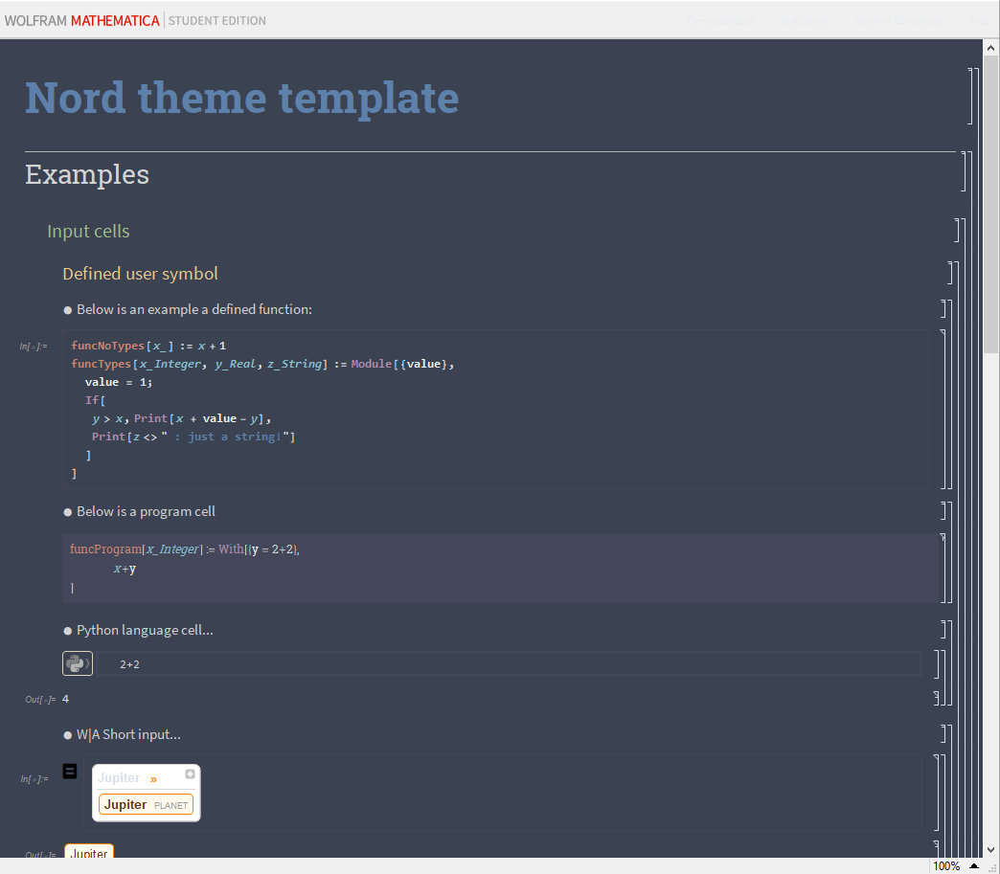

# Nord for [Wolfram Notebooks](https://www.wolfram.com/notebooks/)
> An alternative dark theme for [Wolfram Notebooks](https://www.wolfram.com/notebooks/)

 
 
 

## Install
All instructions can be found in the INSTALL.MD file

## Credit Where Credit is Due
This theme is a shameless fork of Jesse Dohmann's excellent Dracula theme (https://github.com/dracula/wolfram-notebooks).
I just changed a few RGB values, she did a bunch of heavy-lifting getting the stylesheet up and running and in a place where I could modify it.
Massive thanks to her for doing this, and making it public!

## License

[MIT License](./LICENSE)
